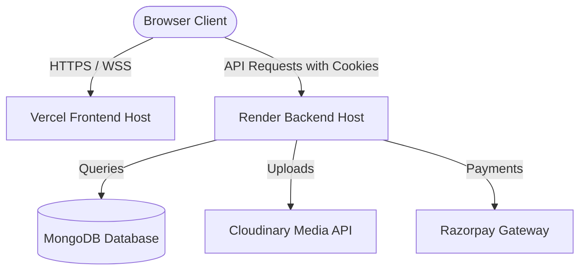

# SyncSummit 🚀

SyncSummit is a premium, full-stack event management and merchandise platform designed to streamline summits, hackathons (like NexusHack), and tech conferences. The project features robust event registration, a merchandise shop with Razorpay integration, real-time updates via WebSockets, and a powerful multi-tier administrative dashboard (User, Admin, Superadmin).

---

## 🌟 Key Features

- **Event Management:** Browse featured events, check details, register, and track registrations.
- **Merchandise Store:** Full shopping cart system, product catalog, and secure checkout.
- **Secure Authentication:** JWT-based authentication using secure, HTTP-only, cross-site cookies.
- **Role-Based Access Control:** Separate interfaces and endpoint permissions for Users, Admins, and Superadmins.
- **Razorpay Integration:** Complete payment flow integration for merchandise purchases and paid event registrations.
- **Cloudinary Storage:** Persistent and optimized cloud-based media storage for event banners and product images.
- **Real-Time Communication:** Socket.io integration for instant updates and notifications.
- **Security First:** Protected with Helmet headers, rate-limiting, and strict CORS policies.

---

## 🛠️ Tech Stack

### Frontend
- **Framework:** React 19 (Vite)
- **State Management:** Zustand (with persistence)
- **Routing:** React Router Dom v7
- **Styling:** CSS-in-JS & Vanilla CSS (using custom CSS variables and utility classes)
- **Animations:** Framer Motion
- **Icons:** Lucide React
- **Client communication:** Axios (with cross-origin credentials enabled)
- **Real-time updates:** Socket.io-client

### Backend
- **Runtime:** Node.js (ES Modules)
- **Framework:** Express
- **Database:** MongoDB (using Mongoose ODM)
- **Payments:** Razorpay SDK
- **Media Uploads:** Multer + Cloudinary Storage
- **Authentication:** JSON Web Tokens (JWT) & Cookie Parser
- **Security:** Helmet, CORS, and Express Rate Limit
- **WebSockets:** Socket.io

---

## 📐 Architecture & Data Flow



---

## 📂 Project Structure

```
SyncSummit/
├── frontend/               # Vite + React Frontend
│   ├── src/
│   │   ├── api/            # Axios configuration & interceptors
│   │   ├── components/     # Reusable UI components & ProtectedRoute
│   │   ├── pages/          # Page components (Home, Dashboards, Shop, etc.)
│   │   ├── store/          # Zustand Auth & State Stores
│   │   └── App.jsx         # App router and bootstrap initialization
│   ├── vercel.json         # Vercel SPA routing redirects
│   └── package.json
│
├── backend/                # Node.js + Express Backend
│   ├── config/             # DB & Cloudinary configs
│   ├── controllers/        # Business logic for endpoints
│   ├── middleware/         # Auth, Role guards, Rate limiter, Upload handlers
│   ├── models/             # Mongoose schemas (User, Event, Product, Order)
│   ├── routes/             # Express routes (Auth, Payment, Admin, Events, etc.)
│   ├── server.js           # Server entrypoint and WebSockets setup
│   └── package.json
```

---

## 🚀 Local Setup & Installation

### Prerequisites
- Node.js (v18+)
- MongoDB (Local or Atlas)
- Cloudinary Account (Optional, falls back to disk uploads locally)
- Razorpay Sandbox API Keys

### Step 1: Clone the Repository
```bash
git clone https://github.com/Zeeshan3h3/SyncSummit.git
cd SyncSummit
```

### Step 2: Configure Backend Environment Variables
Navigate to the `backend` folder, copy `.env.example` to `.env`, and populate it:
```bash
cd backend
cp .env.example .env
```
Provide values for:
- `PORT` (e.g., `3000`)
- `MONGO_URI` (MongoDB connection string)
- `JWT_SECRET` & `JWT_EXPIRE` (e.g., `7d`)
- `CLIENT_URL` (locally `http://localhost:5173`)
- `CLOUDINARY_CLOUD_NAME`, `CLOUDINARY_API_KEY`, `CLOUDINARY_API_SECRET`
- `RAZORPAY_KEY_ID`, `RAZORPAY_KEY_SECRET`

### Step 3: Install & Start Backend
```bash
npm install
npm run dev
```

### Step 4: Configure Frontend Environment Variables
Navigate to the `frontend` folder, create `.env` (or `.env.local`):
```bash
cd ../frontend
```
Create a `.env` file with the following variable:
```env
VITE_API_URL=http://localhost:3000/api
```

### Step 5: Install & Start Frontend
```bash
npm install
npm run dev
```
Open [http://localhost:5173](http://localhost:5173) in your browser.

---

## 🌐 Production Deployment

### Backend (Render / Heroku)
1. Add the following environment variables:
   - `NODE_ENV=production`
   - `CLIENT_URL=https://your-site.vercel.app` (without trailing slash)
   - Add all database, JWT, Cloudinary, and Razorpay keys.
2. Render build command: `npm install`
3. Render start command: `npm start`
4. *Note: Ensure your Render service has **WebSockets** enabled if using real-time features.*

### Frontend (Vercel)
1. Import your frontend folder to Vercel.
2. Set Environment Variable:
   - `VITE_API_URL=https://your-backend.onrender.com/api`
3. Build Settings:
   - Framework preset: `Vite`
   - Build Command: `npm run build`
   - Output Directory: `dist`
4. The repository contains a pre-configured `vercel.json` to handle client-side routing redirects properly when refreshed.

---

## 🔒 Security & CORS Policy

To support secure cross-site cookies (Vercel client to Render backend), the following measures are in place:
1. **Cookie Configuration:** Cookies are configured with `SameSite=None` and `Secure=true` in production to prevent browser blocks.
2. **CORS Configuration:** `cors` middleware explicitly mirrors `CLIENT_URL` and enables `credentials: true`.
3. **Proxy Settings:** Backend has `app.set('trust proxy', 1)` enabled to correctly read forwarding headers through cloud load-balancers (such as Render's Cloudflare setup) without triggering rate-limiter errors.

---

## 🔗 Core API Endpoints

### Auth Route (`/api/auth`)
- `POST /register` - Register a new user
- `POST /login` - Login and receive Http-Only token
- `DELETE /logout` - Clear user auth cookies
- `GET /me` - Get logged-in user profile details (protected)

### Events Route (`/api/events`)
- `GET /` - Retrieve all open/featured events
- `GET /:id` - Get details of a specific event

### Products Route (`/api/products`)
- `GET /` - List merchandise catalog
- `GET /:id` - Get product specifications

### Payments Route (`/api/payments`)
- `POST /checkout` - Initiate Razorpay payment order
- `POST /verify` - Verify webhook payment signature & create orders

### Admin Route (`/api/admin`)
- Accessible only by users with roles `admin` or `superadmin`. Controls CRUD for events, products, and order reports.
